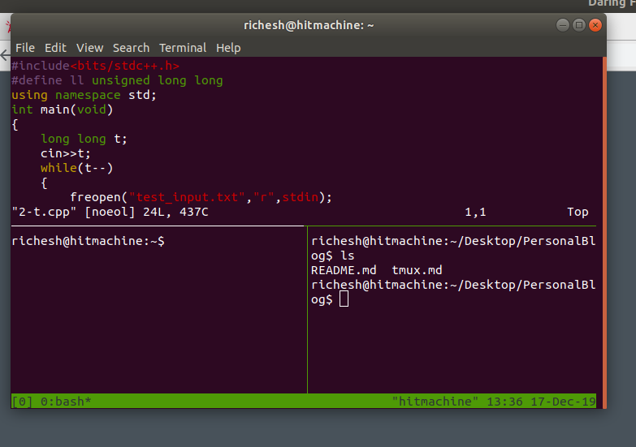

# Tmux - Terminal Emulator
It's an terminal emulator, which means that you can emulate multiple terminal session in one terminal window. 
:relieved:

## why do we need it?
    Boosts your productivity...
## how to install

```bash 
            sudo apt-get install tmux 
```
## Basic Shortcuts
- opening the terminal -> Ctrl + T
- opening Tmux - > tmux
- listing all the sessions of tmux -> tmux ls
- going to any particular session -> tmux attach -t 0 
    [in place of 0 replace the session code]
- ### Opening Session
    - opening another session (horizontally) -> ctrl + b + %
    - Opening another session (vertically) -> ctrl + b + " 
    - opening another window -> ctrl + b + c
- ### Switching the sessions
    - switching -> Ctrl + b + < ArrowKeys >
    - switching circling -> Ctrl + b + o
- ### Resizing the panes 
    - Switch to the active pane then-> [ctrl + b] (hold) + < ArrowKeys >
    

